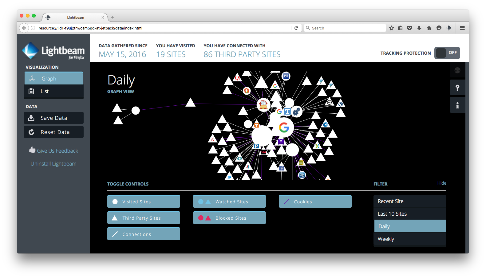
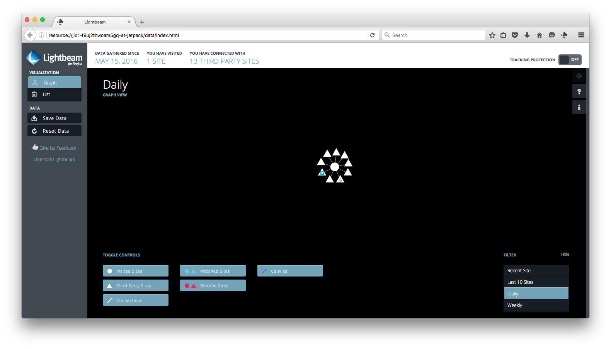
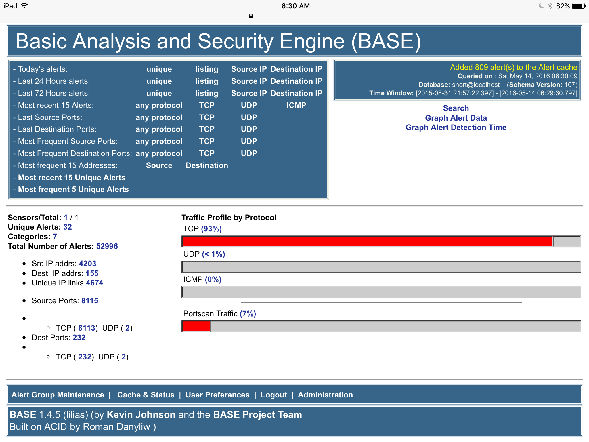
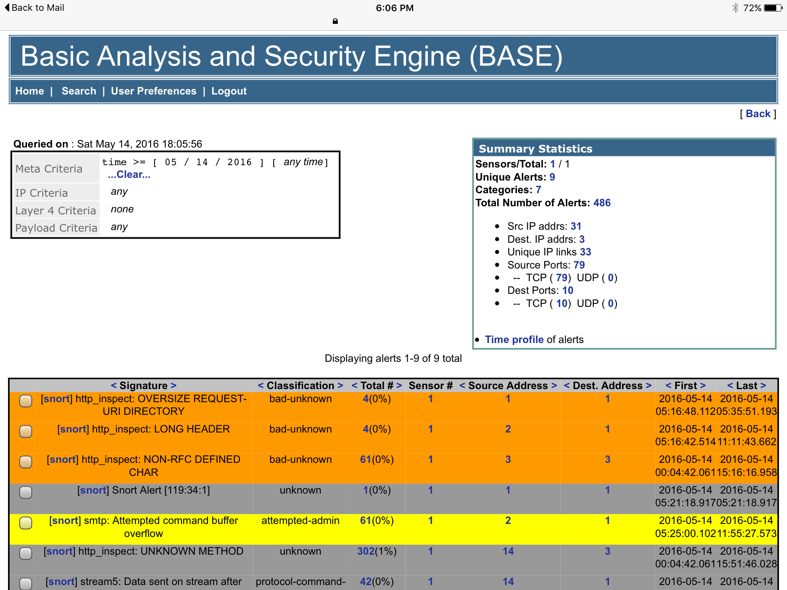

macOS-Fortress
===========

# macOS-Fortress: Firewall, Blackhole, and Privatizing Proxy for Trackers, Attackers, Malware, Adware, and Spammers; with On-Demand and On-Access Anti-Virus Scanning

Kernel-level, OS-level, and client-level security for macOS. Built to address a steady stream of attacks visible on snort and server logs, as well as blocks ads, malicious scripts, and conceal information used to track you around the web. After this package was installed, snort and other detections have fallen to a fraction with a few simple blocking actions.  This setup is a lot more capable and effective than using a simple adblocking browser add-on. There's a world of difference between ad-filled web pages with and without a filtering proxy server. It's also saved me from inadvertantly clicking on phishing links.

## Proxy features
* macOS adaptive firewall
* Adaptive firewall to brute force attacks
* IP blocks updated about twice a day from emergingthreats.net (IP blocks, compromised hosts, Malvertisers) and [dshield.org](https://secure.dshield.org)’s top-20
* Host blocks updated about twice a day from [hphosts.net](https://www.hosts-file.net)
* [EasyList](https://easylist.to/index.html) Tracker and Adblock Rules to Proxy Auto Configuration (PAC) [proxy.pac](https://raw.githubusercontent.com/essandess/easylist-pac-privoxy/master/proxy.pac) file and [Privoxy](http://www.privoxy.org) Actions and Filters
* Uses [easylist-pac-privoxy](../../../easylist-pac-privoxy) and [adblock2privoxy](../../../adblock2privoxy) to easily incorporate multiple blocking rulesets into both PAC and Privoxy formats, including [easyprivacy.txt](https://easylist.to/easylist/easyprivacy.txt), [easylist.txt](https://easylist.to/easylist/easylist.txt), [fanboy-annoyance.txt](https://easylist.to/easylist/fanboy-annoyance.txt), [fanboy-social.txt](https://easylist.to/easylist/fanboy-social.txt), [antiadblockfilters.txt](https://easylist-downloads.adblockplus.org/antiadblockfilters.txt), [malwaredomains_full.txt](https://easylist-downloads.adblockplus.org/malwaredomains_full.txt), and the anti-spamware list [adblock-list.txt](https://raw.githubusercontent.com/Dawsey21/Lists/master/adblock-list.txt).

## Anti-Virus features
* Configures [clamAV](http://www.clamav.net) for macOS with regular on-demand scans and on-access scanning of user `Downloads` 
and `Desktop` directories.
* On-Demand scanning is controlled with the launchd daemon
[org.macports.clamdscan.plist](../../../macOS-clamAV/blob/master/org.macports.clamdscan.plist).
* On-Access scanning via [fswatch](https://github.com/emcrisostomo/fswatch) is controlled with the Macports daemon script 
[ClamdScanOnAccess.wrapper](../../../macOS-clamAV/blob/master/ClamdScanOnAccess.wrapper), itself invoked using the launchd 
daemon [org.macports.ClamdScanOnDemand.plist](../../../macOS-clamAV/blob/master/org.macports.ClamdScanOnDemand.plist). The 
`Downloads` and `Desktop` directories of all active users are watched by default.
* See [macOS-clamAV/README.md](../../../macOS-clamAV/blob/master/README.md) for details on how to grant Full Disk Access to 
the clamav scanning engine for files protected by Mojave TCC.

## Installation

SSH:
> `git clone --recurse-submodules git@github.com:essandess/macOS-Fortress.git`

HTTPS:
> `git clone --recurse-submodules https://github.com/essandess/macOS-Fortress.git`


The install script [readme-and-install.sh](readme-and-install.sh) installs and configures an macOS Firewall and Privatizing
Proxy. It will:
* Prompt you to install Apple's Xcode Command Line Tools and [Macports](https://www.macports.org/)
* Uses Macports to download and install several key utilities and applications (wget gnupg p7zip squid privoxy nmap)
* Configure macOS's PF native firewall (man pfctl, man pf.conf), squid, and privoxy
* Turn on macOS's native Apache webserver to serve the Automatic proxy configuration http://localhost/proxy.pac
* Networking on the local computer can be set up to use this Automatic Proxy Configuration without breaking App Store or other updates (see squid.conf)
* Uncomment the nat directive in pf.conf if you wish to set up an [OpenVPN server](../../../macos-openvpn-server)
* Install and launch daemons that download and regularly update open source IP and host blacklists. The sources are  emergingthreats.net (net.emergingthreats.blockips.plist), dshield.org (net.dshield.block.plist), hosts-file.net (net.hphosts.hosts.plist), and [EasyList](https://easylist.to) (com.github.essandess.easylist-pac.plist, com.github.essandess.adblock2privoxy.plist)
* Install On-Demand and On-Access Anti-Virus scanning using [clamAV](http://www.clamav.net); both scheduled full volume scans 
and on-access scans of all user `Downloads` and `Desktop` directories are performed
* Installs a user launch daemon that deletes flash cookies not related to Adobe Flash Player settings every half-hour  (http://goo.gl/k4BxuH)
* After installation the connection between clients and the internet looks this this:

> **Application** :arrow_right: **`proxy.pac`** :arrow_right:port 3128:arrow_right: **Squid** :arrow_right:port 8118:arrow_right: **Privoxy**  :arrow_right: **Internet**

An auxilliary nginx-based webserver (nominally on `localhost:8119`) is used for both a `proxy.pac` ad and tracker blackhole and for CSS element blocking rules with the Privoxy configuration generated by [adblock2privoxy](../../../adblock2privoxy).

## Disabling/Uninstallation
The disable/uninstall script [disable.sh](disable.sh) will unload all launch daemons, disable the pf firewall, and list all 
installed files **without** removing them.

## Public Service Announcement 

This firewall is configured to block all known tracker and adware content—in the browser, in-app, wherever it finds them. Many websites now offer an additional way to block ads: subscribe to their content. Security and privacy will always necessitate ad blocking, but now that this software has become mainstream with mainstream effects, ad blocker users must consider the [potential impact](http://arstechnica.com/business/2010/03/why-ad-blocking-is-devastating-to-the-sites-you-love/) of ad blocking on the writers and publications that are important to them. Personally, two publications that I gladly pay for, especially for their important 2016 US Presidential election coverage, are the *[New York Times](http://www.nytimes.com)* and *[The Atlantic](http://www.theatlantic.com)*. I encourage all users to subscribe to their own preferred publications and writers.


## Tracker blocking

[Lightbeam](https://www.mozilla.org/en-US/lightbeam/), the tracking tracker Firefox add-on, shows how ad- and tracker-blocking works to prevent third parties monitoring you or your children's online activities. My daughter enjoys the learning exercises at the children's website [ABCya!](http://www.abcya.com). The Lightbeam graph below on the left shows all the third party trackers after less than a minute of browser activity, without using a privatizing proxy. The graph on the right shows all this tracker activity blocked when this privatizing proxy is used.


| 
------------ | -------------
Lightbeam graph without proxy | Lightbeam graph with proxy

This problem is the subject of Gary Kovacs's TED talk, *Tracking Our Online Trackers:*

[](https://www.youtube.com/watch?v=f_f5wNw-2c0 "Tracking our online trackers")


## Attack blocking

The snort intrusion detection system reports far fewer events when known attack sites are blackholed by the packet filter:

| 
------------ | -------------
snort+BASE Overview | snort+BASE Events

## Installation

```
git clone --recurse https://github.com/essandess/macOS-Fortress.git
cd macOS-Fortress
sudo -E sh -x ./readme-and-install.sh
```

## Disabling

```
sudo sh -x ./disable.sh
```

## Notes

* Configure the squid proxy to accept connections on the LAN IP and set LAN device Automatic Proxy Configurations to http://lan_ip/proxy.pac to protect devices on the LAN.
* Count the number of attacks since boot with the script pf_attacks. ``Attack'' is defined as the number of blocked IPs in PF's bruteforce table plus the number of denied connections from blacklisted IPs in the tables compromised_ips, dshield_block_ip, and emerging_threats.
* Both squid and Privoxy are configured to forge the User-Agent. The default is an iPad to allow mobile device access. Change this to your local needs if necessary.
* Whitelist or blacklist specific domain names with the files `/usr/local/etc/whitelist.txt` and `/usr/local/etc/blacklist.txt`. After editing these file, use launchctl to unload and load the plist `/Library/LaunchDaemons/net.hphosts.hosts.plist`, which recreates the hostfile `/etc/hosts-hphost` and reconfigures the squid proxy to use the updates.
* Sometimes pf and privoxy do not launch at boot, in spite of the use of the use of their launch daemons.  Fix this by hand after boot with the scripts `macosfortress_boot_check`, or individually using `pf_restart`, `privoxy_restart`, and `squid_restart`. And please post a solution if you find one.
* All open source updates are done using the `wget -N` option to save everyone's bandwidth

## Security

* These services are intended to be run on a secure LAN behind a router firewall.
* The default proxy configuration will only accept connections made from the local computer (localhost). If you change this to accept connections from any client on your LAN, do not configure the router to forward ports 3128 or 8118, or you will be running an open web proxy.
